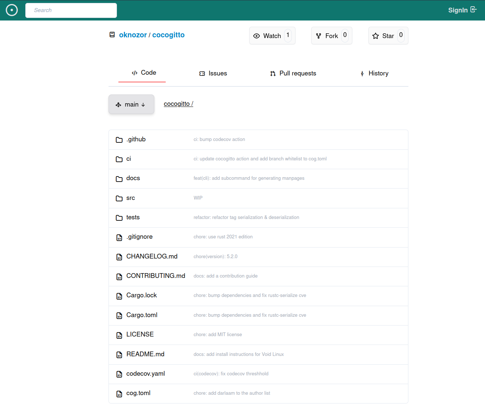
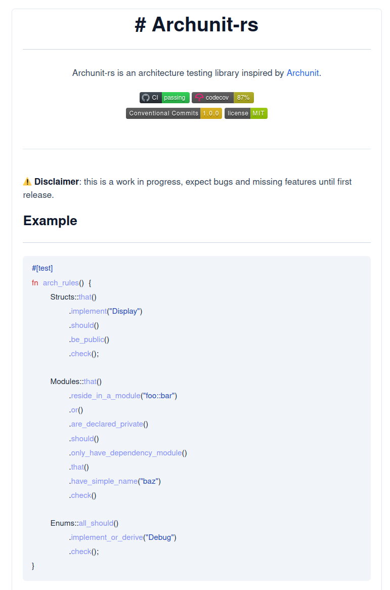
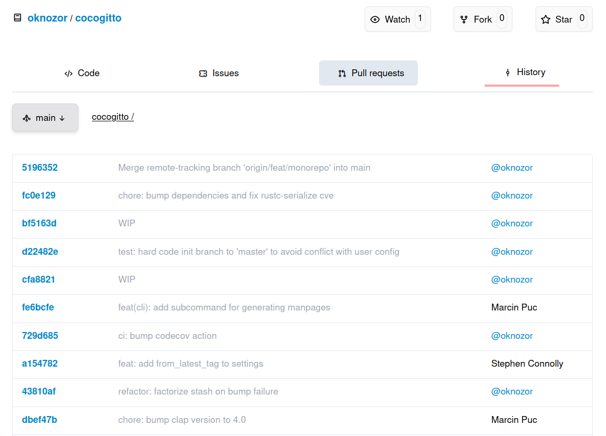
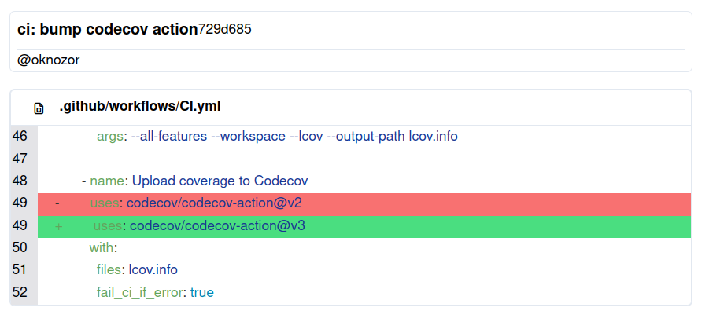

# Gill

Gill is a free and open-source git-service based on [ActivityPub](https://www.w3.org/TR/activitypub/)
and [ForgeFed](https://forgefed.org/). Gill servers are interoperable with other ForgeFed implementation,
allowing users to manage bug reports, merge requests and notifications across instances.

## Disclaimer

⚠️ Gill is far from being ready for production use.
Use at your own risk, expect bugs and breaking changes until first release.

## Demo

Here is a [live demo](https://home-raspberry.gill.pub/oknozor/gill) of Gill. 
Note that the instance is self-hosted on a Raspberrypi 3 with an average upload bandwidth of 4.19Mbps so 
it might feel slow depending on your location. 

## Goal

- Provide a decentralized alternative proprietary git-service.
- Compatibility with other [ForgeFed](https://forgefed.org/) implementation.
- Easy to self-host.

## Planned Features

### Interoperability with [ForgeFed](https://forgefed.org/) implementation

You should be free to choose which platform suits you the most.
Checkout other ForgeFed implementation.

### Git service

Manage merge request, branch protection, user permission, explore repositories etc.

### Project management

Issue tracker, merge request comment, project, kanban etc.

### Rest API

Interface with the Rest API to create plugins, third party tools, bot etc.

## Why is Gill hosted on GitHub ?

For now, we need visibility and support, unfortunately GitHub is the only place offering this.
When the time comes this repository will turn into a read-only mirror and Gill will host itself.

## Can I help ?

### Contributions

While most of the git related features are there. Gill is still at a very early stage.
I am not ready to accept contribution yet, but I hope to get there soon.

### Financial support

I quit my job in November 2022, and I am working full time on Gill since.
Consider donating to help me continue doing so.

### Contact

You can contact me via the [#general-forgefed:matrix](https://matrix.to/#/#general-forgefed:matrix.batsense.net)
channel. 

## Screenshots

These are screenshots of the current Gill user interface which is likely to change.

|  |  |
|-------------------------------------|-------------------------------------|
|  |  |

## License

All the code in this repository is released under the MIT License, for more information take a look at the [LICENSE](LICENSE) file.

